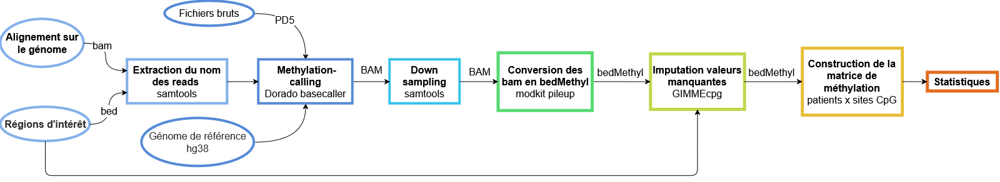

# **Pan-genomic methylation analysis pipeline**
Projet du stage au Centre François Baclesse sur l'étude de la méthylation pangénomique du shallow genome (sequençage Nanopore) dans le cadre du syndrome HBOC.



# Requirements

This pipeline is a **Snakemake workflow**.

## Output directory tree
```
snakemake_workflow = outdir_tmp
├── snakemake_cache
│   ├── cohort_genomic.parquet
│   ├── cohort_matrix.parquet
│   ├── cohort_with_origins.parquet
│   ├── excluded_sites_from_sites_file.bed
│   ├── {session}
│   │   ├── {session}_{barcode}.parquet
│   │   ├── {session}_{barcode}.bed
│   │   ├── {session}_{barcode}.log
│   │   ├── {barcode}.bam
│   │   ├── {barcode}_antitarget.bam
│   │   ├── {barcode}_antitarget_filtered.bam
│   │   ├── {barcode}_filtered.bam
│   │   ├── {barcode}_hihcov.bam
│   │   ├── {barcode}_hihcov_reads.bam
│   │   ├── {barcode}_merged.bam
│   │   ├── {barcode}_merged_sorted.bam
│   │   ├── {barcode}_merged_sorted.bam.bai
│   │   ├── {barcode}_readnames.txt
│   │   ├── {barcode}_sorted.bam
│   │   ├── {barcode}_sorted.bam.bai
│   │   ├── {barcode}_target.bam
│   │   ├── {barcode}_target_ds.bam
│   │   └── ...
│   └── ...
├── imputation_gimmecpg
│   ├── cohort_genomic.parquet
│   ├── cohort_matrix.parquet
│   ├── cohort_with_origins.parquet
│   ├── {session}_{barcode}.bed
│   └── ...
└── snakemake_resultat
    ├── imputation_before
    │   ├── methylation_cohort.tsv
    │   ├── coverage_summary.csv
    │   ├── per_site_coverage.csv
    │   ├── coverage_distribution_covered_at_least_75pct_before_imputation.bed
    │   └── figures
    │       └── ... 
    └── imputation_after
        ├── methylation_cohort.tsv
        ├── clustering_matrix.parquet
        ├── figures
            └── ...
        └── stats
            ├── clustering_matrix.parquet
            └── ...

```

- `snakemake_cache` folder: contient les `{session}` folders qui contiennent les fichiers correspondant aux sorties des étapes suivantes :
    - extraction des noms des reads
    - methylation-calling
    - down sampling
    - modkit.

    Contient aussi les fichiers intermédiaires nécessaires à la construction de la matrice de méthylation pré-imputation.
- `imputation_gimmecpg` folder : contient les bedMethyls avec les valeurs imputées en plus et les fichiers intermédiaires nécessaires à la construction de la matrice de méthylation post-imputation..
- `snakemake_resultat` folder: contient les matrices de méthylation pré et post imputation ainsi que les figures associées aux matrices. Contient également les fichiers en sortie de l'analyse statistique dans `imputation_after` folder.
